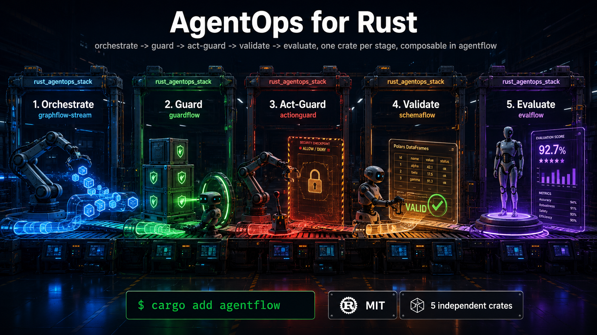

# agentflow

[](https://crates.io/crates/agentflow)
[](https://docs.rs/agentflow)
[](https://github.com/thaicn1712/agentflow/actions/workflows/ci.yml)
[](LICENSE)



DevOps automates software delivery. MLOps adds data and model lifecycle. LLMOps adds prompts, grounding, and hallucination control. **AgentOps** is the next layer down: running autonomous agent graphs in production needs the same discipline — orchestration, guardrails, data validation, evaluation — applied to *agents*, not just models.

`agentflow` is that stack for Rust, in one crate: nine independent crates, each solving a gap Python's ecosystem has and Rust's didn't, composed into one AgentOps lifecycle.

| Stage | Crate | What it does |
|---|---|---|
| **Orchestrate** | [`graphflow-stream`](https://crates.io/crates/graphflow-stream) | Token-level streaming, dynamic map (`DynamicMapTask`) and self-consistency voting (`EnsembleTask`) for [`graph-flow`](https://crates.io/crates/graph-flow) agent graphs |
| **Guard** | [`guardflow`](https://crates.io/crates/guardflow) | Validators + retry-until-valid guard for LLM *output* |
| **Act-guard** | [`actionguard`](https://crates.io/crates/actionguard) | Policy-as-code (deny-overrides, fail-closed) for what an agent is about to *do* |
| **Validate** | [`schemaflow`](https://crates.io/crates/schemaflow) | Pandera-style schema validation for Polars DataFrames |
| **Evaluate** | [`evalflow`](https://crates.io/crates/evalflow) | DeepEval-style graded-score test suites |
| **Checkpoint** | [`rollbackflow`](https://crates.io/crates/rollbackflow) | Snapshot and roll back a task's `Context` to a known-good state |
| **Trace** | [`traceflow`](https://crates.io/crates/traceflow) | Latency, tokens, cost per task — no OpenTelemetry required |
| **Cache** | [`cacheflow`](https://crates.io/crates/cacheflow) | Exact and semantic response caching — skip the repeat LLM call |
| **Remember** | [`memoryflow`](https://crates.io/crates/memoryflow) | Mem0-style long-term memory: retrieve, inject, extract, resolve |

Each is a standalone crate you can `cargo add` on its own. `agentflow` re-exports all nine under one dependency, plus glue code for the parts of the lifecycle that genuinely benefit from knowing about each other.

## Install

```bash
cargo add agentflow
```

## Usage

Re-exports — use any of the nine exactly as documented in their own READMEs:

```rust,ignore
use agentflow::{stream, guard, act_guard, schema, eval, rollback, trace, cache, memory};

let (rx, handle) = stream::spawn_task(my_task, context, 32);
let g = guard::Guard::new().with(guard::validators::NotEmpty);
```

`rollback::CheckpointedTask`, `trace::TracedTask`, `cache::CachedTask`, and `memory::MemoryTask` are all plain `graph_flow::Task` wrappers, so they stack by nesting — no glue code needed to use several together:

```rust,ignore
use agentflow::{cache, trace, rollback};
use std::sync::Arc;

let task = rollback::CheckpointedTask::new(
    trace::TracedTask::new(
        cache::CachedTask::new(my_llm_task, cache_store, key_fn),
        tracer,
    ),
    checkpoint_store,
    session_id,
);
```

Each layer only does its own job: a cache hit skips the LLM call entirely (so `trace` records ~0 cost for that run), and if the whole thing still needs undoing, `rollback` can restore the session's `Context` to before it ran.

The glue `agentflow` does add: `AgentOpsTask<T>` wraps any `graph_flow::Task` with both a guard (hard pass/fail, retried) and metrics (soft graded scores, non-blocking) — the guard→evaluate half of the lifecycle in one task, with scores written into the shared `Context` so anything downstream can read them:

```rust,ignore
use agentflow::pipeline::AgentOpsTask;
use agentflow::guard::Guard;
use agentflow::guard::validators::NotEmpty;
use agentflow::eval::metrics::F1Score;

let task = AgentOpsTask::new(my_task)
    .with_guard(Guard::new().with(NotEmpty))
    .with_max_attempts(3)
    .with_metric(F1Score::default());

let result = task.run(context.clone()).await?;
let f1: Option<f64> = context.get("eval::f1_score");
```

## Why one crate instead of nine

Each crate is deliberately independent — no crate requires another, so you're never forced into the whole stack. `agentflow` exists for the case where you want all nine without hunting down nine separate `cargo add`s, and for the parts of the lifecycle (guard + evaluate together, in `AgentOpsTask`) where composing them by hand would just be boilerplate.

## License

MIT
